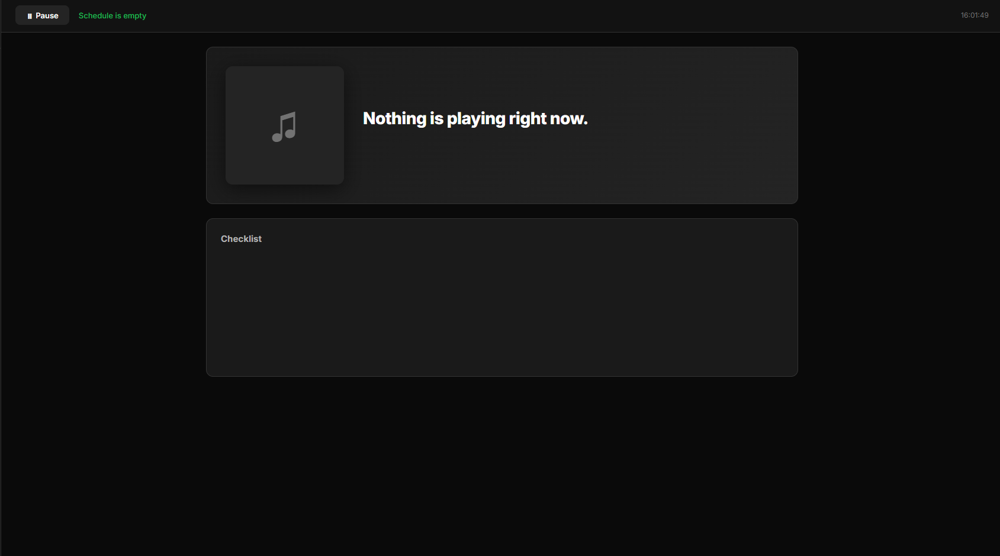

<h1 align="center">Spotify Scheduler (Web Version)</h1>

An improved web-based version of the original Spotify Scheduler.

This application lets you schedule Spotify playlists to play at specific times. Refactored into a modern Web-based architecture (Flask), it features a dark-themed dashboard, easier configuration, and a system tray icon for background operation.

### Key Features
- **Modern Web UI**: Responsive dark-themed dashboard accessible via any browser.
- **Single Instance Prevention**: Automatically opens the existing dashboard if the app is already running.
- **Mandatory Setup**: Guided setup process for Spotify credentials.
- **System Tray Integration**: Manage the app from your taskbar.
- **Random Queue**: Creates random track selections from your playlists (alternative to Spotify's shuffle).

### Setup & Installation
Please refer to the [SETUP.txt](SETUP.txt) file for detailed step-by-step instructions.

**Quick Summary:**
1. Create a Spotify App in the [Developer Dashboard](https://developer.spotify.com/dashboard).
2. Set Redirect URI to: `http://127.0.0.1:5000/callback`.
3. Run `build_exe.bat` and launch the resulting executable in the `dist` folder.

### Supported Languages
- English (en)
- Polish (pl)

---
*Based on the original project by [sandrzejewskipl](https://github.com/sandrzejewskipl/spotify-scheduler).*
